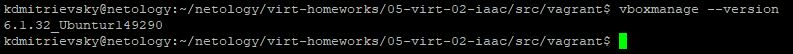
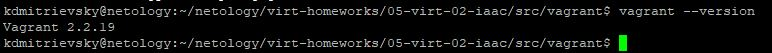
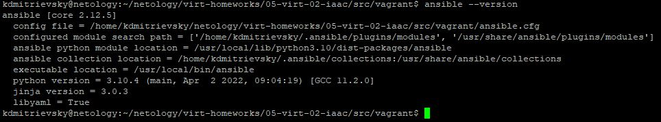
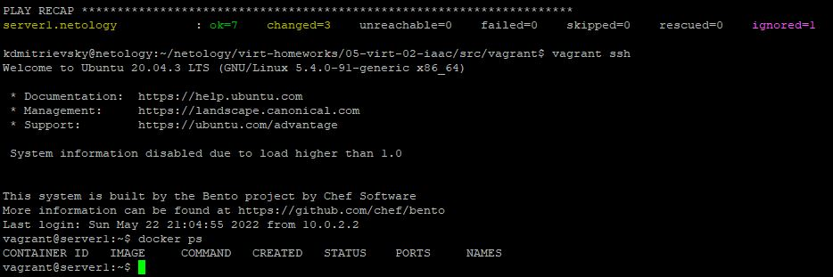

## 5.2. Применение принципов IaaC в работе с виртуальными машинами.  

Задание 1.

Преимущества применения IaaC есть как для Dev-ов, так и для Ops_ов.  
Разработчикам это позволяет быстро находить ошибки в коде за счет постоянного тестирования небольшими объемами и версионирования.
Ops-ам - получать идемпотентную среду для всех участников разработки.  
Основополагающим принципом я считаю Непрерывную интеграцию, конечным результатом которой является прошедший все тесты программный продукт записанный в репозиторий.

Задание 2.

Ansible написан на Python, использует метод push и доступ по SSH. Не требует установки агентов на целевых устройствах в отличие от метода pull. Прост и использует компоненты доступные "по-умолчанию" во всех системах.   
Из двух методов я вижу pull более надежным. Это и исполнение команд непосредственно на целевом устройстве не зависимо от связи с управляющей машиной, и возможность организации независимого обратного канала от целевой машины. Отсутствие необходимости проверки совместимости целевой системы с необходимыми "фичами", возможность их собственной реализации в "агенте". И т.д.  

Задание 3.

Версия Virtualbox:  
  
Версия Vagrant:  
  
Версия Ansible:  
  

Задание 4.  

Результат docker ps на целевой машине:  
  

