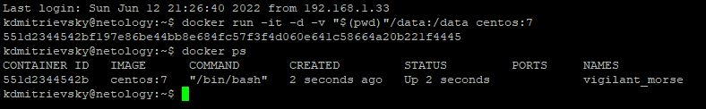
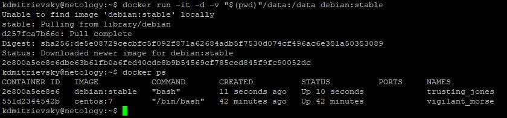
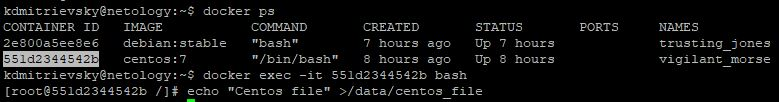
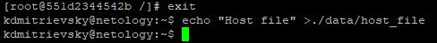
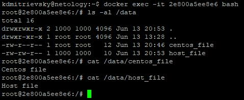

## 5.3. Введение. Экосистема. Архитектура. Жизненный цикл Docker контейнера  

Задание 1. 

* [Dockerfile образа](./src/Dockerfile) Собран на основе Ubuntu 22.04 с установкой Nginx и заменой **index.html**   
* [Индексная страница](./src/index.html)  
* [Ссылка на репозиторий с образом](https://hub.docker.com/repository/docker/kdmitrievsky/my-ubuntu-nginx)  
Строка запуска контейнера: *docker run -d -p 80:80 kdmitrievsky/my-ubuntu-nginx:1.1.01*  
Дополнительно: [Ссылка на репозиторий с образом](https://hub.docker.com/repository/docker/kdmitrievsky/my-nginx) (Сделан просто на основе Nginx:latest с изменением **index.html**)  

Задание 2.  

* **Высоконагруженное монолитное java веб-приложение** - монолитное веб-приложение предполагает сборку всего в одном и frontend, и backend, и UserInterface. Так как оно еще и высоконагруженное, то стоит использовать, как мне кажется, виртуализацию. Она позволит гибко управлять ресурсами, лекго масштабировать приложение за счет новых виртуальных машин и балансера на входе. Контейнеризация здесь не подойдет.  
* **Node.js веб-приложение** - здесь, для решения задачи, применима контейнеризация, node.js как javascript среда для построения логики работы веб-приложения хорошо укладывается в микросервисную архитектуру.  
* **Мобильное приложение c версиями для Android и iOS** - я, честно говоря, далёк от разработки мобильных приложений Android  и iOS, но в Интернет видел несколько статей об использовании Docker в таких проектах. Например: создание образа для сборки приложения со всеми зависимостями используя свойство иденпотентности Docker. Так что, думаю, использование Docker здесь подходит.
* **Шина данных на базе Apache Kafka** - опять не встречал, но по статьям в Интернете понятно, что здесь тоже подходит использование Docker. Сервис легко "горизонтально" масштабируется.  
* **Elasticsearch кластер для реализации логирования продуктивного веб-приложения - три ноды elasticsearch, два logstash и две ноды kibana** - опять же здесь можно использовать Docker. Одна нода - один контейнер
* **Мониторинг-стек на базе Prometheus и Grafana** - как и в предыдущем пункте это хороший вариант применения Docker. Можно прекрасно применить IaaC.
* **MongoDB, как основное хранилище данных для java-приложения** - опять же подходит для применения Docker, на том же Habr-е есть статьи. Базу присоединяют либо подключив папку с хоста, либо используя volume.  
* **Gitlab сервер для реализации CI/CD процессов и приватный (закрытый) Docker Registry** - и здесь Docker применим. На GitLab есть официальная статья инсталяции на Docker, есть статья и по организации приватного Docker репозитория.  

Задание 3.

* Запускаем первый контейнер:  
  
* Запускаем второй контейнер:  
  
* Подключаемся к первому контейнеру и создаем первый файл:  
  
* Возвращаемся на host-машину и создаем второй файл:  
  
* Подключаемся ко второму контейнеру и проверяем файлы:  
  

Задание 4.  

[Ссылка на репозиторий с образом kdmitrievsky/ansible:2.10.0](https://hub.docker.com/repository/docker/kdmitrievsky/ansible)  

