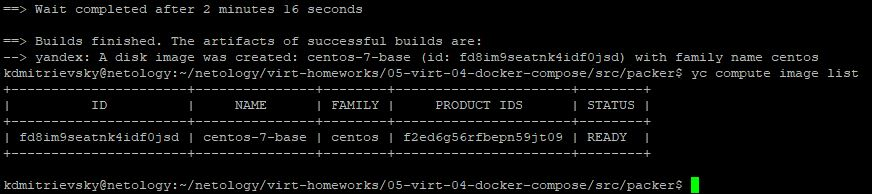
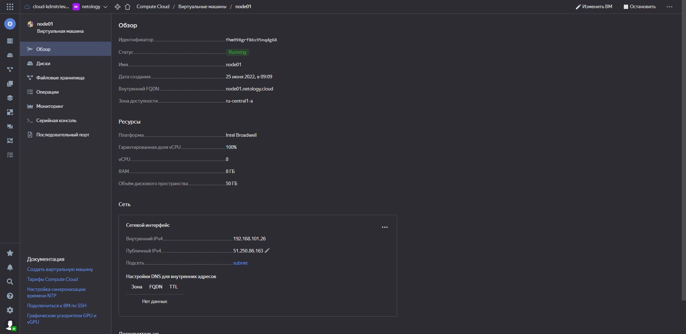
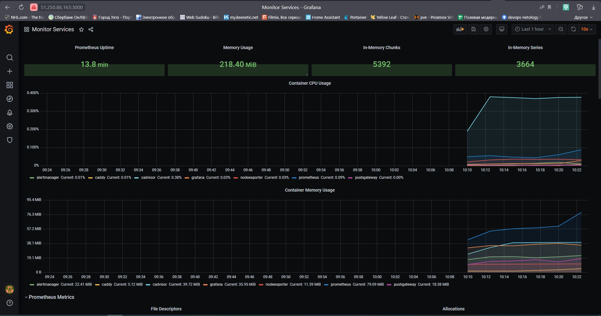

## 5.4. Оркестрация группой Docker контейнеров на примере Docker Compose  

Задание 1.  
* Образ созданный Packer:  

  

Задание 2.  
* Созданная виртуальная машина:  

  

Задание 3.  
* Созданные компоненты мониторинга:  

  
P.S.: А обязательно в плейбук надо было параметр **name** модуля **yum** во всех местах поменять на **package**? )))   
