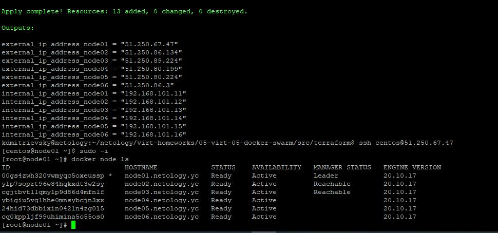
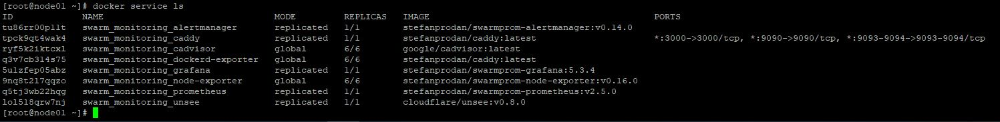
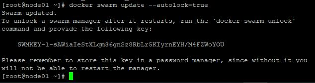

## 5.5.Оркестрация кластером Docker контейнеров на примере Docker Swarm  

Задание 1.  
* Если режим работы сервиса Global, то будет запущено по одной реплике сервиса на каждой ноде кластера. Если режим работы сервиса Replication, то будет запущено столько реплик сервиса, сколько указано в конфиге, и на тех нодах которые указаны в конфиге.  
* Для выбора лидера кластера используется алгоритм RAFT. Он построен на распределенном консенсусе. Если сервер не видит "лидера", то он становится "кандидатом" и рассылает всем серверам "запрос на голосование". Каждый сервер голосует "за" только один раз, за первого достучавшегося. Выйгравший выборы становится "лидером" и начинает переодически рассылать свои личные сообщения. Отсутствеи таких сообщений говорит о том, что "лидер" пропал и нужно новое голосование.  
* Overlay Network - частная сеть в Docker Swarm для обмена информацией между сервисами и контейнерами Docker, находящимися на различных узлах кластера.  

Задание 2.  
Создание Docker Swarm кластера:  
  

Задание 3.  
Кластер мониторинга:  

Задание 4.  
Исполнение команды *docker swarm update --autolock=true*  
  
Эта команда блокирует доступ к менеджеру кластера
